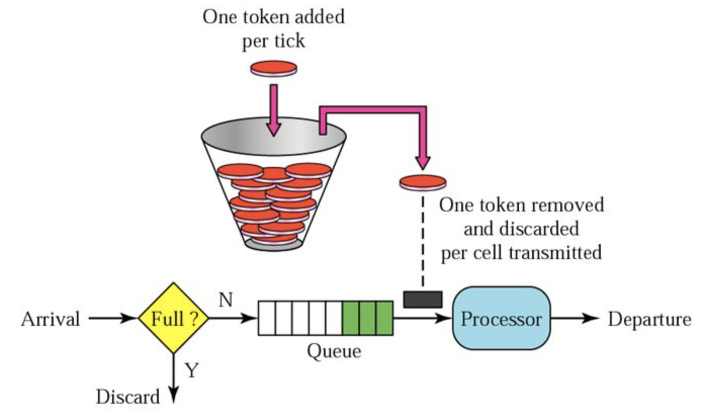

# 限流
限流是保护高并发系统的三大利器之一，另外两个是缓存和降级。限流在很多场景中用来限制并发和请求量，比如说秒杀抢购，保护自身系统和下游系统不被巨型流量冲垮等。

限流的目的是通过对并发访问/请求进行限速或者一个时间窗口内的的请求进行限速来保护系统，一旦达到限制速率则可以拒绝服务或进行流量整形。

## 常用限流方法
常用的限流方式和场景有：限制总并发数（比如数据库连接池、线程池）、限制瞬时并发数（如nginx的limitconn模块，用来限制瞬时并发连接数，Java的Semaphore也可以实现）、限制时间窗口内的平均速率（如Guava的RateLimiter、nginx的limitreq模块，限制每秒的平均速率）；其他还有如限制远程接口调用速率、限制MQ的消费速率。另外还可以根据网络连接数、网络流量、CPU或内存负载等来限流。

RateLimiter常用：限制方法在一段时间内平均被调用次数不超过某个数字

# 限流算法
## 漏桶算法

形象解释：
入口->水流->桶（有漏洞）->水流->出口

1. 正常情况：入口水流与出口水流持平。桶中几乎没有积水
2. 超量情况：入口水流远大于出口水流。桶中不断积水，最后溢出

实现方法：
使用队列实现，有处理器按照固定速率从队列头取出请求进行计算。
请求到达如队列未满则直接放入队列。如请求量大导致队列满，则抛弃新请求


## 令牌桶算法

形象解释：
令牌（固定速率）->桶
请求->缓冲器->能否拿到令牌？->计算

1. 按照固定速率往桶里添加令牌。桶中存放的令牌数有最大上限，超出之后就被丢弃或者拒绝
2. 当流量或者网络请求到达时，每个请求都要获取一个令牌，如果能够获取到，则直接处理，并且令牌桶删除一个令牌
3. 如无法获取令牌，则选择丢弃或在缓冲区等待

# RateLimiter
Guava是Java领域优秀的开源项目，它包含了Google在Java项目中使用一些核心库。RateLimiter是其中的限流器实现。RateLimiter提供了令牌桶算法的两种具体实现。由RateLimiter的两个子类实现：
- 平滑突发限流 SmoothBursty :
- 平滑预热限流 SmoothWarmingUp :

注：本文源码分析基于：com.google.guava-18.0

``` java
// RateLimiter提供了两个工厂方法，最终会调用下面两个函数，生成RateLimiter的两个子类。
// SmoothBursty类
static RateLimiter create(SleepingStopwatch stopwatch, double permitsPerSecond) {
 RateLimiter rateLimiter = new SmoothBursty(stopwatch, 1.0 /* maxBurstSeconds */);
    rateLimiter.setRate(permitsPerSecond);
 return rateLimiter;
}
// SmoothWarmingUp类
static RateLimiter create(
 SleepingStopwatch stopwatch, double permitsPerSecond, long warmupPeriod, TimeUnit unit,
 double coldFactor) {
 RateLimiter rateLimiter = new SmoothWarmingUp(stopwatch, warmupPeriod, unit, coldFactor);
    rateLimiter.setRate(permitsPerSecond);
 return rateLimiter;
}
```

## 平滑突发限流
使用：
使用 RateLimiter的静态方法创建一个限流器，设置每秒放置的令牌数为10个。返回的RateLimiter对象可以保证1秒内不会给超过10个令牌，并且以固定速率进行放置，达到平滑输出的效果。

注意：最终使用时计算出的时间间隔不保证一定是准确的0.1s。可能存在误差，在需要精确限流时需要注意

```java
public static void main(String[] args) {
  // 创造一个limiter，平均每秒能获取10个token
  RateLimiter limiter = RateLimiter.create(10);

  for (int i = 0; i < 10; i++) {
    System.out.println("get 1 token, need: " + limiter.acquire() + "s");
  }
}
 /**
     * 约0.1s执行一次
     * get 1 token, need: 0.0s
     * get 1 token, need: 0.099736s
     * get 1 token, need: 0.084306s
     * get 1 token, need: 0.099511s
     * get 1 token, need: 0.089593s
     * get 1 token, need: 0.095184s
     * get 1 token, need: 0.099848s
     * get 1 token, need: 0.089194s
     * get 1 token, need: 0.099824s
     * get 1 token, need: 0.090818s
     */
```

## 平滑预热限流
SmoothWarmingUp是带有预热期的平滑限流，它启动后有一段预热期，逐步将分发频率提升到配置的速率。
如下代码中分发速率是2，预热期是5秒。限流器会在前5秒内限制速度，最后再恢复到每秒2次的分发速率
```java
public static void main(String[] args) {
  // 创造一个limiter，平均每秒能获取10个token
  RateLimiter limiter = RateLimiter.create(2, 5, TimeUnit.SECONDS);
  
  for (int i = 0; i < 10; i++) {
    System.out.println("get 1 token, need: " + limiter.acquire() + "s");
  }

  /**
     * 先预热，再加速到预设时间
     * get 1 token, need: 0.0s
     * get 1 token, need: 1.39981s
     * get 1 token, need: 1.189238s
     * get 1 token, need: 0.999016s
     * get 1 token, need: 0.799373s
     * get 1 token, need: 0.599583s
     * get 1 token, need: 0.487746s
     * get 1 token, need: 0.499393s
     * get 1 token, need: 0.499531s
     * get 1 token, need: 0.495839s
     */
}
```

## 使用方法

1. 使用acquire

每次调用```doSomeThing```时，程序都会在```limiter.acquier()```处阻塞等待。直到limiter获取token，才会继续往后执行do something。从而达到限流效果
```java
public class limiter {

    RateLimiter limiter = RateLimiter.create(10);
    
    public void doSomeThing() {
        limiter.acquire();
        // do something
    }
}
```

2. 使用tryAcquire

每次调用```doSomeThing```时，程序都会在```limiter.tryAcquier()```等待。与上面不同的时，这个阻塞式等待设置有最长等待时间。如成功在500ms内获取token，则返回true可以继续执行逻辑。如果未能在500ms内获取token，则表示获取token失败，事实上已经超过了qps限制，需要执行失败逻辑。

```java
public class limiter {

    RateLimiter limiter = RateLimiter.create(10);

    public void doSomething(){
        // 等待获取token，最大时长为500ms
        if(limiter.tryAcquire(500, TimeUnit.MILLISECONDS)){
            // 执行逻辑
        }else {
            // 超过500ms，无法获取到token
            // 执行失败逻辑
        }
    }
}
```

# 源码解析

## 构造函数

创建stopWatch，然后调用create，传入```permitsPerSecond```创建子类的SmoothBursty
```java
  create(SleepingStopwatch.createFromSystemTimer(), permitsPerSecond);

  static RateLimiter create(SleepingStopwatch stopwatch, double permitsPerSecond) {
    RateLimiter rateLimiter = new SmoothBursty(stopwatch, 1.0 /* maxBurstSeconds */);
    rateLimiter.setRate(permitsPerSecond);
    return rateLimiter;
  }

  public final void setRate(double permitsPerSecond) {
    checkArgument(
        permitsPerSecond > 0.0 && !Double.isNaN(permitsPerSecond), "rate must be positive");
    synchronized (mutex()) {
      doSetRate(permitsPerSecond, stopwatch.readMicros());
    }
  }
```

## 时间相关
先来看看代码中时间相关的基本计算方法

stopWatch源码
```java
public final class Stopwatch {
  private final Ticker ticker;
  private boolean isRunning;
  private long elapsedNanos;
  private long startTick;

  Stopwatch() {
    this(Ticker.systemTicker());
  }

  public Stopwatch start() {
    checkState(!isRunning, "This stopwatch is already running.");
    isRunning = true;
    startTick = ticker.read();
    return this;
  }

    static final SleepingStopwatch createFromSystemTimer() {
      return new SleepingStopwatch() {
        final Stopwatch stopwatch = Stopwatch.createStarted();

        @Override
        long readMicros() {
          return stopwatch.elapsed(MICROSECONDS);
        }

        @Override
        void sleepMicrosUninterruptibly(long micros) {
          if (micros > 0) {
            Uninterruptibles.sleepUninterruptibly(micros, MICROSECONDS);
          }
        }
      };
```

其中ticker.read()调用系统的ticker并记录
```java
  public static Ticker systemTicker() {
    return SYSTEM_TICKER;
  }
  private static final Ticker SYSTEM_TICKER = new Ticker() {
    @Override
    public long read() {
      return Platform.systemNanoTime();
    }
  };
```
我们可以明白，rateLimiter的时间计算本质上基于系统的ticker计算。由于系统的tick计算是基于系统所在的计算平台的CPU频率与时钟频率，如不能精确计算CPU时钟频率则无法实现精密时间计算。因此RateLimiter在计算高精度的时间时可能出现误差。一个具体表现就是上面例子中预估0.1s获取一次时，经常出现误差，无法精确做到0.1s一次。（其实这个问题还有另一种解释，可以继续往下看）

## SmoothBursty
我们继续查看SmoothBursty类的源码

```java
static final class SmoothBursty extends SmoothRateLimiter {
    /** The work (permits) of how many seconds can be saved up if this RateLimiter is unused? */
    // 当未使用时，最多可以缓存几秒的令牌（默认为0）
    final double maxBurstSeconds; 
    
    SmoothBursty(SleepingStopwatch stopwatch, double maxBurstSeconds) {
      super(stopwatch);
      this.maxBurstSeconds = maxBurstSeconds;
    }

  }
```

doSetRate流程：

先计算```double stableIntervalMicros = SECONDS.toMicros(1L) / permitsPerSecond;```然后设置SmoothBursty中的```maxPermits```（默认为1秒的值）为```permitsPerSecond```
```java
  doSetRate(permitsPerSecond, stopwatch.readMicros());

  final void doSetRate(double permitsPerSecond, long nowMicros) {
    // resync函数用于刷新同步tokens，具体见后面分析
    resync(nowMicros);
    // 计算每个令牌之间的时间间隔
    double stableIntervalMicros = SECONDS.toMicros(1L) / permitsPerSecond;
    this.stableIntervalMicros = stableIntervalMicros;
    doSetRate(permitsPerSecond, stableIntervalMicros);
  }

  @Override
    void doSetRate(double permitsPerSecond, double stableIntervalMicros) {
      double oldMaxPermits = this.maxPermits;
      // 计算能够存放的最大令牌数量
      maxPermits = maxBurstSeconds * permitsPerSecond;
      if (oldMaxPermits == Double.POSITIVE_INFINITY) {
        // if we don't special-case this, we would get storedPermits == NaN, below
        storedPermits = maxPermits;
      } else {
        storedPermits = (oldMaxPermits == 0.0)
            ? 0.0 // initial state
            : storedPermits * maxPermits / oldMaxPermits;
      }
    }
```


## acquire流程
```java
public double acquire(int permits) {
    // 计算令牌获取所需等待时间
    long microsToWait = reserve(permits);
    // 线程sleep
    stopwatch.sleepMicrosUninterruptibly(microsToWait);
    return 1.0 * microsToWait / SECONDS.toMicros(1L);
  }

final long reserve(int permits) {
    checkPermits(permits);
    // 并发操作，使用锁
    synchronized (mutex()) {
      return reserveAndGetWaitLength(permits, stopwatch.readMicros());
    }
  }

final long reserveAndGetWaitLength(int permits, long nowMicros) {
    // 计算获取令牌的时间，并将这个时间存储到下一次
    long momentAvailable = reserveEarliestAvailable(permits, nowMicros);
    // 减去当前时间，获得等待时间
    return max(momentAvailable - nowMicros, 0);
  }

final long reserveEarliestAvailable(int requiredPermits, long nowMicros) {
    resync(nowMicros);
    long returnValue = nextFreeTicketMicros;
    // 计算当前可以获得的令牌数量
    double storedPermitsToSpend = min(requiredPermits, this.storedPermits);
    // 机制上允许一次获取大量令牌，并预支未来的令牌
    // 计算预先支付令牌数量
    double freshPermits = requiredPermits - storedPermitsToSpend;
    // 需要等待的时间=当前消耗令牌所占用时间+预支令牌所占用时间
    long waitMicros = storedPermitsToWaitTime(this.storedPermits, storedPermitsToSpend)
        + (long) (freshPermits * stableIntervalMicros);

    // 计算出下一次空闲的时间
    this.nextFreeTicketMicros = nextFreeTicketMicros + waitMicros;
    // 消耗令牌
    this.storedPermits -= storedPermitsToSpend;
    return returnValue;
  }

  // 刷新token函数
  void resync(long nowMicros) {
    // 如果当前时间晚于nextFreeTicketMicros，刷新令牌和nextFreeTicketMicros
    if (nowMicros > nextFreeTicketMicros) {
      // 计算刷新后的storedPermits
      // 当前时间减去nextFreeTicketMicros，再除以获取令牌的时间间隔，得到这段时间内的令牌数
      storedPermits = min(maxPermits,
        storedPermits+ (nowMicros - nextFreeTicketMicros) / coolDownIntervalMicros());
      nextFreeTicketMicros = nowMicros;
    }
    // 如果当前时间早于nextFreeTicketMicros，则获取令牌的线程要一直等待到nextFreeTicketMicros,该线程获取令牌所需
    // 额外等待的时间由下一次获取的线程来代替等待。
  }

  // coolDownIntervalMicros函数获生成一个令牌的间隔
  // 注：SmoothWarmingUp和SmoothBuresty的实现不同
  // SmoothBuresty的coolDownIntervalMicros直接返回stableIntervalMicros（之前在setRate中获取）
  double coolDownIntervalMicros() {
    return stableIntervalMicros;
  }
```

流程：
1. 尝试获取令牌
2. 调用reserveEarliestAvailable
3. 调用resync，同步时间与令牌
4. 计算storedPermitsToSpend
5. 计算是否需要预先支付令牌
6. 计算waitMicros
7. 更新nextFreeTicketMicros
8. 减少storedPermits
9. 让stopWatch等待nextFreeTicketMicros
10. 返回，表示acquire成功

注意点：
1. RateLimiter在没有足够令牌发放时，采用滞后处理的方式。前一个请求获取令牌所需等待的时间计算waitMicros由下一次请求来承受，也就是代替前一个请求进行等待。
2. RateLimiter拥有预支令牌机制。当请求的令牌数量超过设置的qps上限后，可以预支后几秒的令牌放行当前动作。后果是后几秒的令牌获取受阻


# 总结
- RateLimiter可以用于单机qps限制，并且带有令牌预支付功能。使用起来简单方便。
- 缺点：无法实现qps的精确计算，仅能限制到一定时间内的平均qps。
- 仅适用于单机qps。如需用于集群的qps限制，可能需要将总qps除以集群机器数量，得到单机qps上限后再设置。
