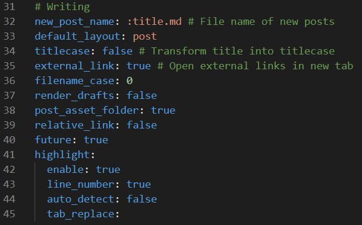

参考资料：
- Hexo搭建独立博客全纪录（三）使用Hexo搭建博客: [链接](https://baoyuzhang.github.io/2017/05/12/%E3%80%90Hexo%E6%90%AD%E5%BB%BA%E7%8B%AC%E7%AB%8B%E5%8D%9A%E5%AE%A2%E5%85%A8%E7%BA%AA%E5%BD%95%E3%80%91%EF%BC%88%E4%B8%89%EF%BC%89%E4%BD%BF%E7%94%A8Hexo%E6%90%AD%E5%BB%BA%E5%8D%9A%E5%AE%A2/)
- NexT主题的优化定制修改指南: [链接](https://blog.csdn.net/u012195214/article/details/79204088)
- Next官方页面：[链接](https://github.com/theme-next)

# Hexo使用
## 页面配置
hexo文件夹下的配置文件`_config.yml`为整个hexo的配置文件。首先第一段属性主要用于配置网站的整体信息，description和keywords用于SEO搜索引擎优化，可以暂时不管。


|属性|描述|
|-----|----|
|title|网站标题|
|subtitle|网站副标题|
|description|网站描述|
|keywords|网站关键词|
|author|网站作者|
|language|网站使用的语言(中文为zh-CN)|
|timezone|网站时区，默认为电脑时区|

第二部分的配置有关网站的写作布局格式以及资源链接功能

```
# Writing
new_post_name: :title.md    #新文章的名称
default_layout: post    #默认的文章格式
titlecase: false # Transform title into titlecase   #标题转换为首字母大写
external_link: true # Open external links in new tab    #新标签中打开链接
filename_case: 0    #文件名转换为（0）不变（1）小写（2）大写
render_drafts: false    #显示草稿
post_asset_folder: true #对每篇文章生成asset文件夹
relative_link: false
future: true    #显示上一篇与下一篇文章文章
highlight:#代码块相关
  enable: true          #允许使用代码块
  line_number: true     #显示行号
  auto_detect: false    #自动检测
  tab_replace:          #tab替换
```

## Hexo常用命令
常用命令
```
hexo new "postName" #新建文章
hexo generate #生成静态页面至public目录
hexo server #开启预览访问端口（默认端口4000，'ctrl + c'关闭server）
hexo deploy #部署到GitHub
hexo help  # 查看帮助
hexo clean #清除当前生成的所有页面，用于配合generate重新生成，去除bug
hexo version  #查看Hexo的版本
```
常用命令缩写
```
hexo n == hexo new
hexo g == hexo generate
hexo s == hexo server
hexo d == hexo deploy
```
组合命令
```
hexo s -g #生成并本地预览
hexo d -g #生成并上传
```

## 新建页面
执行`hexo new '文章名'`，hexo会帮我们在`..\hexo\source\_posts`下生成相关markdown文件,打开该文件就可以开始编辑博客了
其中的文件头有以下含义，注意每个属性冒号后都有空格
```
title: #文章名
date: 2019-06-20 19:41:17
categories: #分类
tags: #文章标签 使用[tag1,tag2,tag3]的形式，
description: #该文章简介
```
使用`hexo g`命令后，该markdown文件会在public文件夹中自动生成对应的html文件，之后会自动加入文章列表

## 页面模板
在hexo根目录下有scaffold文件夹。Hexo会根据scaffold中的markdown文件为模板来新建文章。使用`hexo new 文章名`命令时，默认按照post.md为模板
```
---
title: {{title}}
date: {{date}}
tags:
---
```
例如，我想要默认生成的文件中加入categories这个属性，可以把这个模板改为
```
---
title: {{title}}
date: {{date}}
tags:
categories:
---
```
同理，可以创建多个不同模板，使用`hexo new 模板名称 文章名`来调用不同模板

## 插入图片
### 我的做法
1. 首先，在hexo的`_config.yml`中将`post_asset_folder`设为true。这样每次创建新文章，hexo都会在source的post文件夹中创建同名的资源文件夹，用于存放图片等资源
2. 在hexo根目录执行`npm install hexo-asset-image --save`，安装图片地址转换的插件
3. 使用`hexo new XXX`生成文章时，在`source/_posts`中放入需要插入的图片
4. 在文章的markdown文件中使用如下格式插入图片：
   ```
   
   ```
5. 检查生成的网页中是否成功

### 官方文档做法
官网链接：<https://hexo.io/zh-cn/docs/asset-folders.html>
> 通过常规的 markdown 语法和相对路径来引用图片和其它资源可能会导致它们在存档页或者主页上显示不正确。在Hexo 2时代，社区创建了很多插件来解决这个问题。但是，随着Hexo 3 的发布，许多新的标签插件被加入到了核心代码中。这使得你可以更简单地在文章中引用你的资源。
```



```
> 比如说：当你打开文章资源文件夹功能后，你把一个 example.jpg 图片放在了你的资源文件夹中，如果通过使用相对路径的常规 markdown 语法  ，它将 不会 出现在首页上。（但是它会在文章中按你期待的方式工作）
> 正确的引用图片方式是使用下列的标签插件而不是 markdown ：
```

```
> 通过这种方式，图片将会同时出现在文章和主页以及归档页中。

官方的做法需要在markdown文档中插入html标签，我个人认为这种方式并不好。所以我没有选择官方做法，而是继续采取markdown语句来插入。如果未来遇到无法插入的问题，会再尝试官方方法。


# Next主题
现在，你学会了Hexo的基本操作，但是你可能还觉得你的网站不够好看。怎么办呢？我们可以在github上寻找主题来美化我们的网站。
这里我使用的是github使用排名第一的Next主题。
## Next主题的安装
### 下载
这里直接从github下载最新版本。如果这种方法不行，可以考虑下载release page中的zip解压到对应目录
```
$ cd hexo
$ git clone https://github.com/theme-next/hexo-theme-next themes/next
```
### 启用
在hexo目录下的`_config.yml`中，将`theme`字段的值改为`next`。这样Hexo会直接调用themes文件夹下的next主题包

接着使用`hexo clean`清除缓存，使用`hexo g`重新编译。可以看到主题已经生效，能够显示最基本的helloworld页面了

## Next配置
### 主题设置
Next提供了4个默认主题，在themes/next/_config.yml`中搜索scheme关键字，可以看到如何配置。这里我选用了Pisces主题
```
# ---------------------------------------------------------------
# Scheme Settings
# ---------------------------------------------------------------

# Schemes
# scheme: Muse
# scheme: Mist
scheme: Pisces
# scheme: Gemini
```
- Muse：默认 Scheme，这是 NexT 最初的版本，黑白主调，大量留白
- Mist：Muse 的紧凑版本，整洁有序的单栏外观
- Pisces：双栏 Scheme，小家碧玉似的清新
- Gemini：左侧网站信息及目录，块+片段结构布局

### 动态背景
你经常在别人博客上看到并眼馋的动态背景！就是这个。
在`themes/next/_config.yml`中搜索canvas关键字，可以看到如下代码
```
# Canvas-nest
# Dependencies: https://github.com/theme-next/theme-next-canvas-nest
canvas_nest:
  enable: true
  onmobile: true # display on mobile or not
  color: "0,0,255" # RGB values, use ',' to separate
  opacity: 0.5 # the opacity of line: 0~1
  zIndex: -1 # z-index property of the background
  count: 50 # the number of lines

# JavaScript 3D library.
# Dependencies: https://github.com/theme-next/theme-next-three
# three_waves
three_waves: false
# canvas_lines
canvas_lines: false
# canvas_sphere
canvas_sphere: false
```
设置为true则开启动态背景。在具体属性中可以设置线条的样式。建议将count减少，防止低配置电脑打开的卡顿。同时还提供了3种3D动态背景，喜欢的可以自己尝试

### 当前浏览进度
修改`themes/next/_config.yml`， `scrollpercent` 值由 false 改为 true：
```
# Scroll percent label in b2t button
scrollpercent: true
```

### 文章“分类”与“标签”的设置
使用`hexo new page categories`建立categories，其中自动生成了`index.md`，修改为：
```
---
title: categories
date: 2019-06-20 17:06:31
type: "categories"
---
```
对tags也进行同样操作，这样在Next主题的主页下就能进入“分类”和“标签”页面了。之后的内容会自动生成，可以不用管

### “About”页面设置
同理，使用`hexo new page about`来生成about页面，在index.md中可以编辑个人相关信息。

### 字数统计功能
参考页面<https://github.com/theme-next/hexo-symbols-count-time>
新版本的Next主题中，插件重新整合，因此使用了新api。这里直接使用新api来进行字数统计
1. 安装
   ```
   $ npm install hexo-symbols-count-time --save
   ```
2. 在hexo根目录下的`_config.yml`中，添加如下代码来启用word count功能。
   ```
   symbols_count_time:
    symbols: true
    time: true
    total_symbols: true
    total_time: true
    exclude_codeblock: false
   ```
3. 在Next主题中寻找相关代码进行配置
    ```
    symbols_count_time:
        separated_meta: true
        item_text_post: true
        item_text_total: false
        awl: 2
        wpm: 275
        suffix: mins.
    ```
    其中，`awl`和`wpm`的值请参阅官方文档进行配置。
    如果页面中字数统计的文字出现了乱码，请打开`theme/next/languages`文件夹对自己选用的语言进行查看并debug

# 最后的话
Next还有许多优化手段，这里就不一一写出（其实我也不会）。大家有兴趣的可以自己再去研究
