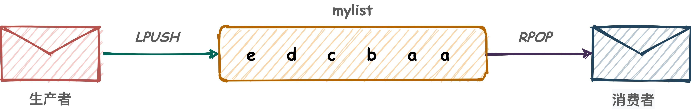
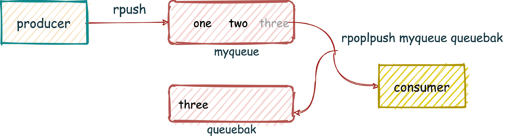

# 本文来源参考
[Redis 消息队列的三种方案](https://javakeeper.starfish.ink/data-management/Redis/Redis-MQ.html)
[redis消息队列，你敢不敢用？](https://juejin.cn/post/7094272373930590245)

# 为什么使用Redis作为消息队列
当前使用较多的 消息队列 有 RabbitMQ、RocketMQ、ActiveMQ、Kafka、ZeroMQ、MetaMQ 等，而部分数据库 如 Redis、MySQL 以及 phxsql ，如果非要使用的话，其实也可实现消息队列的功能。

那为什么要使用Redis作为消息队列？
在一些简单的业务场景中，仅需要简单功能，使用重量级可能不需要重量级的 MQ 组件(相比 Redis 来说，Kafka 和 RabbitMQ 都算是重量级的消息队列)

优势：
- 方便：目前很多项目开发已引入 redis。因此，运维、学习成本等较低
- 轻量级：开箱即用，也可以自己做一层简单封装
- 多样性：可根据需求选择底层队列结构

同样的，以下几种Redis作为消息队列的做法也存在各自的缺点。接下来会具体情况具体分析

# 回顾消息队列
我们使用的消息队列，一般有如下特点：
1. 三个角色：生产者、消费者、消息处理中心
2. 异步处理模式：生产者 将消息发送到一条 虚拟的通道(消息队列)上，而无须等待响应。消费者 则 订阅 或是 监听 该通道，取出消息。两者互不干扰，甚至都不需要同时在线，也就是我们说的 松耦合
3. 对可靠性的需求

其中，对可靠性的需求，可能有如下三点：
- 需求一：消息保序
    需要确保按照生产者发送消息的顺序
- 需求二：不重复消费
    有时会因为网络堵塞出现消息重传的情况，这种情况下，不能重复消费重复信息
- 需求三：消息可靠性保证
    因为故障或宕机重启后，可以重新读取未完成的消息

因此，如果使用Redis作为消息队列，我们也部分或全部需要满足这些特点或需求

# 基于List实现消息队列
Redis 列表是简单的字符串列表，按照插入顺序排序。你可以添加一个元素到列表的头部(左边)或者尾部(右边)。

所以常用来做异步队列使用。将需要延后处理的任务结构体序列化成字符串塞进 Redis 的列表，另一个线程从这个列表中轮询数据进行处理。

## 相关List常用命令
- LPUSH|RPUSH|LPOP|RPOP:将元素左插入、右插入、左弹出、右弹出等
- BLPOP|BRPOP:弹出元素，如不存在则等待
- BRPOPLPUSH|RPOPLPUSH: 从列表中弹出一个值，将弹出的元素插入到另外一个列表中并返回它； 如果列表没有元素会阻塞列表直到等待超时或发现可弹出元素为止。

## 基于简单List的消息队列
组合使用
- LPUSH、RPOP 左进右出
- RPUSH、LPOP 右进左出

具体逻辑：
1. 生产者使用LPUSH命令将消息一次写入List
2. 消费者使用RPOP命令从LIST另一端取出，进行消费

Java代码
```java
redisTemplate.opsForList().leftPush(redisKey, value);

redisTemplate.opsForList().rightPop(redisKey, value);
```



优势：
1. 因为Redis单线程的特点。在消费数据时，同一个消息必定不会被多个consumer消费
2. 简单易实现

### 存在问题与解决方法
如何实现消息队列可靠性的三个需求？

#### 性能风险
消费者如果想要及时的处理数据，就要在程序中写个类似 while(true) 这样的逻辑，或者使用sleep(1000)，不停的去调用 RPOP 或 LPOP 命令，这就会给消费者程序带来些不必要的性能损失。

解决方案：
使用BLPOP、BRPOP等阻塞式命令
客户端在没有读到队列数据时，自动阻塞，直到有新的数据写入队列，再开始读取新数据。这种方式就节省了不必要的 CPU 开销。如果将超时时间设置为 0 时，即可无限等待，直到弹出消息

使用：
- LPUSH、BRPOP 左进右阻塞出
- RPUSH、BLPOP 右进左阻塞出

#### 消息有序性问题
- 在单个消费者情况下，消息必定有序
- 在多个消费者情况下同时读取同一个队列时，可能无法保证消息有序，需要特殊处理。可以考虑用下文的消息中添加全局唯一ID的做法解决

#### 消息重复问题
假设生产者因为网络或其他原因，在队列中多次发送同一个消息。为解决这个问题。需要：
- 每条消息需要全局唯一性ID；
- 消费者需要记录处理过消息的ID;
- 消息的全局唯一ID需要生产者在发送消息前自动生成

#### 消息多播问题
基于List的消息队列，完全无法扩展支持多消费者阅读同一消息功能

## 基于ACK机制的可靠队列
在基于普通队列的方式中，List队列的消息一旦被发送，便从队列中被删除。如果由于网络等各种原因，消费者没有正确处理消息，那么这条消息对应的数据很有可能丢失。

为了保证消息可靠性，需要使用确认机制的的消息队列。在Redis中，我们可以使用BRPOPLPUSH|RPOPLPUSH命令，每次都在获取消息的同时将消息复制到另一个list中（作为备份），这个过程是原子的。

使用:
- LPUSH、RPOPLPUSH
- RPUSH、LPOPRPUSH

具体逻辑：
1. 生产者使用RPUSH命令将消息写入list
2. 消费者尝试取出所有在list_backup中的消息
2. 如不存在list_backup，则临时将当前list中所有消息放入list_backup中，再获取




### 一种伪代码的实现
```java
// 入队
public void schedule(Object o) {
    ...
    redis.lpush(o);
    ...
}

// 出队
public Object poll() {
    ...
    // 取出一个元素, 并存储备份队列
    Object o = redis.brpoplpush("source_queue", "destination_backup_queue", 1000);
    ...
    return o;
}

// ACK 
public Object commit(String message) {
    ...
    // 从备份队列中删除
    // 当然这里删除操作复杂度为 O(n)，其中 n 为备份队列元素个数
    jedis.lrem("destination_backup_queue", message)
    ...
}

// 故障恢复
public void recoverFromCrash() {
   ...
   // 1. 取出所有未 ACK 的 message
   List<String> messages = redis.lrange("destination_backup_queue", 0, -1);
   // 2. 遍历 messages
   foreach o in messages {
       // 3. 重新入队
       this.schedule(o);
   }
   ...
}
```


### 另一种批量实现
```java
    /**
     * 插入
     */
    public void setRedisSyncInfoList(List<RedisSyncInfo> redisSyncInfoList) {
        if (redisSyncInfoList == null) {
            return;
        }
        String redisKey = RedisKeyConstant.SYNC_LIST_KEY.getRedisKey();
        List<String> valueList = redisSyncInfoList.stream().map(JacksonUtils::toJsonStrByJackson).collect(Collectors.toList());
        redisTemplate.opsForList().leftPushAll(redisKey, valueList);
    }

    /**
     * 获取队列中的所有redisSyncInfo
     * 1. 如果备份队列不存在，则移动所有当前队列值到备份队列中
     * 2. 获取队列中的所有redisSyncInfo
     *
     * @return List<RedisSyncInfo>
     */
    public List<RedisSyncInfo> getRedisSyncInfoList() {
        String redisKey = RedisKeyConstant.SYNC_LIST_KEY.getRedisKey();
        String backUpRedisKey = RedisKeyConstant.SYNC_LIST_BACKUP_KEY.getRedisKey();
        if (!Boolean.TRUE.equals(redisTemplate.hasKey(backUpRedisKey))) {
            String element = null;
            do {
                element = redisTemplate.opsForList().rightPopAndLeftPush(redisKey, backUpRedisKey);
            } while (element != null);
        }
        List<String> values = redisTemplate.opsForList().range(backUpRedisKey, 0, -1);
        if (CollectionUtils.isEmpty(values)) {
            return new ArrayList<>();
        } else {
            return values.stream().map(value -> JacksonUtils.convertToObject(value, RedisSyncInfo.class)).collect(Collectors.toList());
        }
    }

    /**
     * 成功获取后，删除备份队列
     */
    public void ackGetRedisSyncInfo() {
        String backUpRedisKey = RedisKeyConstant.SYNC_LIST_BACKUP_KEY.getRedisKey();
        redisTemplate.delete(backUpRedisKey);
    }
```

## 基于zset的延时消息队列
在日常开发中，可能经常遇到需要延时队列来处理的场景。这种场景，可以考虑使用 redis 的 zset 来实现。

zset 是一个有序的结构。我们可以利用zset结构中的score参数来控制延时。每次取第一个元素来判断能否处理，如果第一个元素都不能处理，说明之后的元素都没有到执行时间。

和list 类似，zset也需要一个备份队列来保证消息的可靠性。将消息先存入备份队列，再从原队列中删除消息，才算是取出了消息；当客户端提交了 ACK 之后，再从备份队列中删除消息

### 一种伪代码实现
```java
public Object poll() {
    // 1. 取第一个元素
    Object o = jedis.zrangeWithScores(queueName, 0, 0)
    // 2. 然后和当前时间比，是否已到了处理时间
    if (o == null || o.getScheduledAt() > nowTime) {
        return null
    }
    // 做一些逻辑判断
    ...
    // 这里为了安全起，先拿到一个元素，放入备份队列之后再从原队列中删除
    // 3. 先放入备份队列
    jedis.hset("backup", key, o.getContent());
    // 4. 在从 zset 中删除
    jedis.zrem(queueName, o.getContent())
}

// ACK
public Object commit(String key) {
    ...
    // 从备份队列中删除
    // 时间复杂度 O(1)
    jedis.hdel("backup", key)
    ...
}

// 故障恢复
public void recoverFromCrash() {
   ...
   // 1. 取出所有未 ACK 的 key
   List<String> keys = redis.hkeys(keyName);
   // 2. 遍历 keys
   foreach key in keys {
       // 3.重新拿到这条消息
       Object o = redis.hget(keyName, key);    
       // 4. 重新入队
       this.schedule(o);
   }
   ...
}
```

消息的有序性？zset 结构本身是按照 score 有序的，因此从消息投递先后来看便是无序；你可以根据 score 参数值的大小来控制消息在队列的先后顺序
重复消息处理和消息可靠性保障与 list 结构实现的队列类似

### 可靠性
如何实现消息队列可靠性的三个需求？

1. 消息的有序性
zset 结构本身是按照 score 有序的，因此从消息投递先后来看便是无序；你可以根据 score 参数值的大小来控制消息在队列的先后顺序

2. 重复消息处理
    与 list 结构实现的队列类似

3. 消息可靠性保障
    与 list 结构实现的队列类似

同样，zset的队列也完全无法扩展支持多消费者阅读同一消息功能

## 基于发布订阅模式的消息队列
可以在Redis中使用Pub/Sub模块来支持消息多播，即发布/订阅模式(publish/subscribe)，它是一种消息通信模式：发布者(pub)发送消息，订阅者(sub)接收消息。

发布者会将的消息发布到一个chanel（通道）中而不是发送给指定的订阅者，发布者也不知道可能有哪些订阅者。

订阅者可以订阅一个或多个channel，只接收来自订阅的channel的消息，并且不知道有哪些（如果有）发布者，这种模式实现了消息发布者和订阅者的解耦。

Pub/Sub 与键空间无关，消息不会被持久化，与数据库也无关，在db10上发布，将可以被 db1 上的订阅者听到。如果我们需要某种范围的范围，那么只能在设置的channel名字上做区分。


### 严重缺陷
使用Redispublish发布的消息在Redis系统中不能持久化，因此，必须先执行订阅，再等待消息发布。如果先发布了消息，那么该消息由于没有订阅者，消息将被直接丢弃。

消息只管发送，不管接收，也没有ACK机制，无法保证消息的消费成功。如果某个消费者中途加入进来，或者挂掉重启，那么这之前丢失的消息也不能再次消费。

以上的缺点导致Redis的Pub/Sub模式就像个玩具，在生产环境中完全无法使用，非常尴尬。最终Redis的作者也不建议使用该方式作为消息队列。这里就不展开讲了。


## 基于Streams的消息队列解决方案
list 和 zset 实现的队列不能很好支持多消费者的场景。Redis 从 5.0 版本开始提供的 Streams 数据类型，是为 redis 设计的消息队列，能支持多消费组的场景。

Streams 支持的操作：
- XADD：插入消息，保证有序，可以自动生成全局唯一 ID；
- XLEN：查询stream队列长度
- XRANGE：返回范围数据
- XREAD：用于读取消息，可以按 ID 读取数据，也可一次读取多个数据；
- XGROUP：用于创建、销毁、管理消费组（类似于kafka消费组的概念）
- XREADGROUP：按消费组+消费者形式读取消息；消息队列中的消息一旦被消费组里的一个消费者读取了，就不能再被该消费组内的其他消费者读取了。
- XPENDING 和 XACK：XPENDING 命令可以用来查询每个消费组内所有消费者已读取但尚未确认的消息，而 XACK 命令用于向消息队列确认消息处理已完成。

Streams底层：像是个仅追加内容的消息链表，把所有加入的消息都串起来，每个消息都有一个唯一的 ID 和对应的内容。并且消息是持久化的。

每个 Stream 都有唯一的名称，它就是 Redis 的 key，在我们首次使用 xadd 指令追加消息时自动创建。

Redis中Stream作为消息队列的功能十分完善，基本满足了现代消息队列的需求，可堪大用。

# 总结

常用的redis消息队列解决方案：
- redis list结构
- zset权重延迟队列
- publish\subscribe模式
- stream多消费队列

其中:
1. 基于list与zset的方案较简单，但不支持多播。在复杂需求中可能无法实现
2. publish\subscribe模式不支持持久化。在生产环境万一崩溃可能产生很大问题，redis作者自己最后也不推荐该模式
3. Streams 是 Redis 5.0 专门针对消息队列场景设计的数据类型。Redis 是 5.0 及 5.0 以后的版本，可以优先考虑把 Streams 用作消息队列了。


总的来说，Redis作为消息队列有方便、轻量级、实现方式多等优点。但不正确的使用Redis作为消息队列，可能产生消息挤压或导致消息数据丢失。因此，redis 队列可以考虑在非核心业务或在需要快速实现的业务中使用。先衡量场景与需求、合适的技术方案才是最好的！


